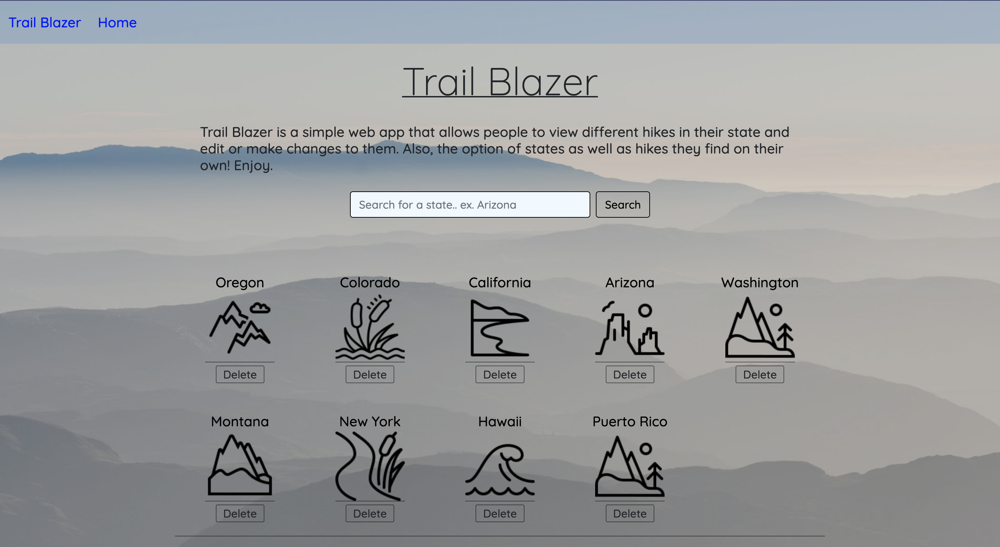
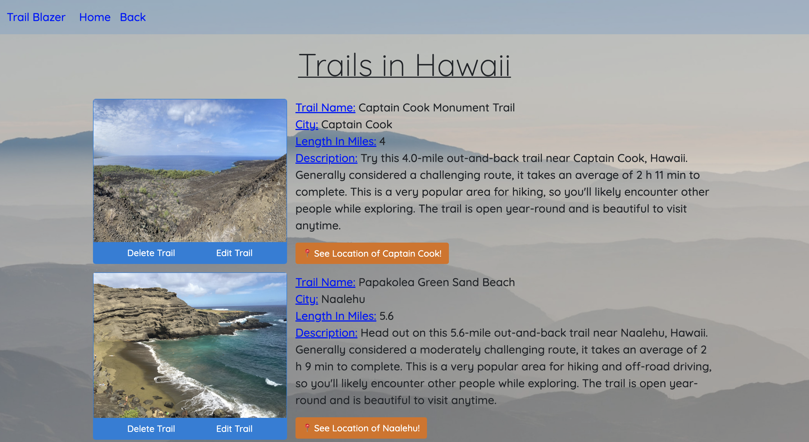
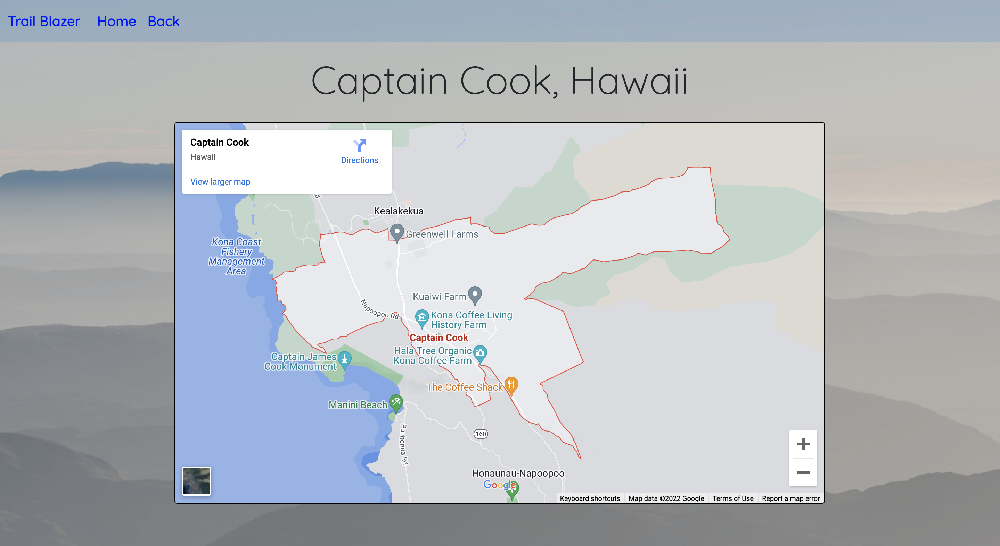
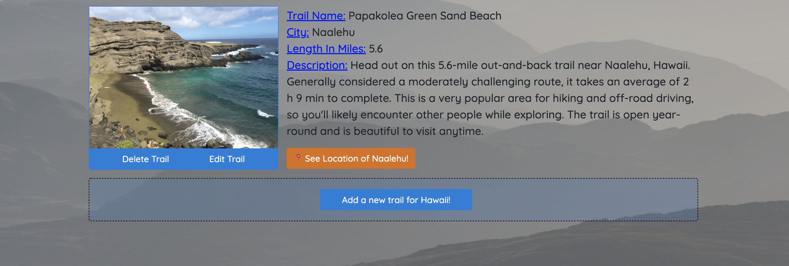

# Trail Blazer

## About This Project :

Trail Blazer is a full CRUD application that provides hiking trails in the US states listed on the home page!

## Features :

- Ability to search for specific States via the search bar.
- Functionality to add or delete States from the home menu.
- Clicking on a State gives you the ability to see what trails users have added for that State
- Ability to Add, Delete, or Edit hiking trails for each State.
- Link provided on show page of the hiking trail to see the city the hiking trail is located in on a map provided by Google. 📍

## Built With :

- ![node.js]
- ![express.js]
- ![mongodb]
- ![heroku]
- ![HTML5]
- ![CSS3]

<!-- USAGE EXAMPLES -->

# Views

(<a href="#top">back to top</a>)

[node.js]: https://img.shields.io/badge/Node.js-43853D?style=for-the-badge&logo=node.js&logoColor=white
[html5]: https://img.shields.io/badge/HTML5-E34F26?style=for-the-badge&logo=html5&logoColor=white
[css3]: https://img.shields.io/badge/CSS3-1572B6?style=for-the-badge&logo=css3&logoColor=white
[express.js]: https://img.shields.io/badge/Express.js-404D59?style=for-the-badge
[mongodb]: https://img.shields.io/badge/MongoDB-4EA94B?style=for-the-badge&logo=mongodb&logoColor=white
[heroku]: https://img.shields.io/badge/Heroku-430098?style=for-the-badge&logo=heroku&logoColor=white
